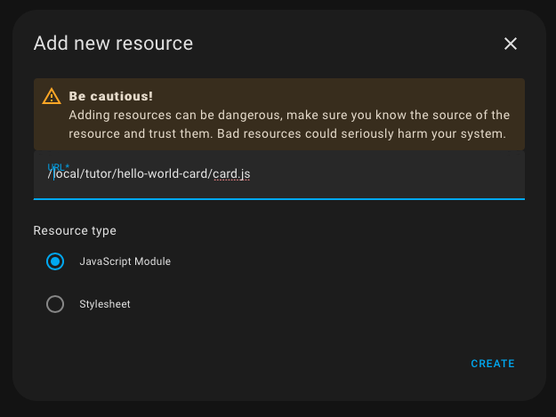

# Hello World Card
A minimal card with manual setup
***


* @published: January 2023
* @author: Elmar Hinz
* @workspace: `conf/www/tutor`

The target of this tutorial is to show minimal steps to be done to get hello
world output from a card written all by yourself. The setup is still done
manually to understand the technical requirements. More advanced solutions will
be covered by future tutorials. Please understand minimal as a reasonable
minimum to get started, not as the absolute minimum.

## Prerequisites

* a development environment (see tutorial 1)
* the Prerequisites named there
* basic skills of JavaScript
* a workspace `conf/www/tutor`

## Cloning the Repository

You may clone this repository into your workspace and follow along.
Alternatively you may want to write the code yourself, to get a deeper effect of
learning. Just decide what works best for you.

Fork the repository on Github into your own instance. Open the workspace
directory in the command-line. Call `git clone <URL>`. Use the `URL` Github does
give you, when you click the button `Code`. If your setup is well done, you
should prefer `SSH` over `HTTPS`. This allows you to easily push to your
repository.

## The Cards Code

Find the code in the file named `card.js` alongside with this README.

### Configuration

While setting up your card in the dashboard, `setConfig()` gets triggered upon
edit with the configuration data. This method is required. You use it here to
update the internal config property. In the second tutorial, you will go a step
ahead.

```js
    setConfig(config) {
        this.config = config;
    }
```

### View

```js
set hass(hass) {
    const entityId = this.config.entity;
    const state = hass.states[entityId];
    const stateStr = state ? state.state : 'unavailable';
```

The `hass()` setter gets triggered, when the state of the hass object is
changing. First we extract the information of our interest into constants,
to prepare them for the output.

```js
if (!this.content) {
    this.innerHTML = `
        <ha-card header="Hello ${hass.user.name}!">
            <div class="card-content"></div>
        </ha-card>
    `;
    this.content = this.querySelector('div');
}
```

The HTML enclosure of the card (including the header) gets setup once. It does
not change. Nonetheless we can use the user name here. There is a new instance
per login. The inner `<div>` as a placeholder gets assigned to the content
variable.

```js
this.content.innerHTML = `
    <p>The ${entityId} is ${stateStr}.</p>
`;
```

Only the dynamic node is updated upon each call to minimize changes of the DOM
tree.

### Visit the Official Documentation

You should know [the official
documentation](https://developers.home-assistant.io/docs/frontend/custom-ui/custom-card),
too. This tutorial is based upon it. It defines a method `getCardSize()` in
addition, you should know about. This is not required for a hello world example
and I avoid the discussion if pixels are a suitable unity for HTML at all.

## Running the Code

### Adding the Ressource

Open your admin account of the development environment in the web browser. Did
you already unlock **Advanced Mode**?


Go to ***Settings*** > ***Dashboard***. Click the three dots in the upper right
hand corner to open ***Resources***. Click ***ADD RESOURCE*** in the lower right
hand corner.

As the URL enter `/local/tutor/<YourRepoName>/card.js`. Replace `<YourRepoName>`
with the repo name you use. Choose ***JavaScript Module*** and submit.



### Using the Card

Go to a dashboard. Use the three dots in the upper right hand corner to edit the
dashboard. Take control if required. Click ***+ ADD CARD***. At the bottom
select ***Manual*** to add a custom card.


In the card configuration enter:

```yaml
type: 'custom:hello-world-card'
entity: sun.sun
```

Don't forget the `custom` prefix, as you add a custom card. The type of the card
is the type you did register in the last line of the `card.js` file:

```js
customElements.define('hello-world-card', HelloWorldCard);
```

If everything went well so far, congratulations! You should now see the output of the first card you created yourself. Try different entities.


